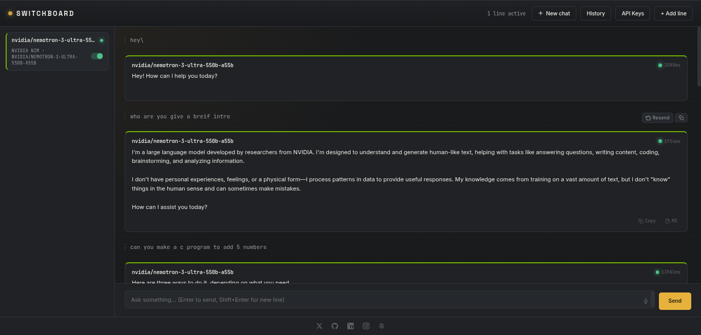

# Switchboard

**One prompt. Every model. Answering at once.**

Switchboard is a self-hosted web app that routes a single chat prompt to multiple AI providers in parallel — OpenAI, Anthropic, DeepSeek, Google Gemini, Groq, NVIDIA NIM, OpenRouter, Mistral, xAI, Together AI, and Cerebras — and streams the responses back side-by-side.



## Features

- **Parallel calls** — all active models receive your prompt simultaneously.
- **Live token streaming** — text appears word-by-word as each model generates it, instead of waiting for the full reply. The backend reuses pooled HTTPS connections to each provider, so repeated calls skip the TLS handshake overhead.
- **Per-model conversation threads** — every "line" keeps its own history. Mute or swap a model mid-conversation without losing context.
- **Keys stay in your browser** — API keys are stored only in `localStorage` and sent directly from your browser to the provider. The backend never logs them.
- **Voice input** — mic button uses the Web Speech API; review and confirm before sending.
- **Session history** — conversations are auto-saved locally and can be resumed at any time.
- **Copy as Markdown** — one-click copy of any response with the model name embedded.

## Pages

| Route | Description |
|-------|-------------|
| `/home` | Marketing / landing page |
| `/app` | The chat application |
| `/about` | How it works + privacy info |

## Quick start

```bash
# 1. Clone
git clone https://github.com/your-handle/switchboard.git
cd switchboard

# 2. Create and activate a virtual environment (recommended)
python -m venv .venv
source .venv/bin/activate   # Windows: .venv\Scripts\activate

# 3. Install dependencies
pip install -r requirements.txt

# 4. Run
python app.py
```

Open [http://localhost:5000/home](http://localhost:5000/home).

## Configuration

No config file is needed. All settings (provider API keys, model selections, conversation history) are stored in the user's browser `localStorage`.

To change the port, edit the last line of `app.py`:

```python
app.run(debug=False, port=5000, threaded=True)
```

## Supported providers

| Provider | Models (examples) |
|----------|-------------------|
| OpenAI | `gpt-4o`, `gpt-4o-mini`, `o1-mini` |
| Anthropic | `claude-sonnet-4-6`, `claude-opus-4-7` |
| DeepSeek | `deepseek-v4-flash`, `deepseek-v4-pro`, `deepseek-chat`, `deepseek-reasoner` |
| Google Gemini | `gemini-2.0-flash`, `gemini-1.5-pro` |
| Groq | `llama-3.3-70b-versatile`, `mixtral-8x7b-32768` |
| NVIDIA NIM | `deepseek-ai/deepseek-v3.2`, `moonshotai/kimi-2.5` |
| OpenRouter | `deepseek/deepseek-v3.2`, `meta-llama/llama-3.3-70b-instruct`, and hundreds more |
| Mistral | `mistral-large-latest`, `mistral-small-latest` |
| xAI (Grok) | `grok-4`, `grok-4-fast` |
| Together AI | `deepseek-ai/DeepSeek-V3.2`, `meta-llama/Llama-3.3-70B-Instruct-Turbo` |
| Cerebras | `llama-3.3-70b`, `deepseek-r1-distill-llama-70b` |

Any provider that speaks the OpenAI chat-completions dialect can be added in `providers.py`.

## Security

- **Security headers** on every response: `X-Content-Type-Options`, `X-Frame-Options: DENY`, `Referrer-Policy`, `Permissions-Policy`, and a tight `Content-Security-Policy`.
- **Input validation** — prompts capped at 32 000 chars, model IDs validated by regex, history trimmed and sanitised before any outgoing request.
- **No logging of user data** — the server logs only HTTP status codes, never prompt content or API keys.
- **`debug=False`** in production — never deploy with `debug=True`.

## Production deployment

For a real deployment, run behind a WSGI server such as Gunicorn:

```bash
pip install gunicorn
gunicorn -w 4 -b 0.0.0.0:8000 app:app
```

Put Nginx or Caddy in front for TLS, rate limiting, and static file serving.

## License

MIT — see [LICENSE](LICENSE).
